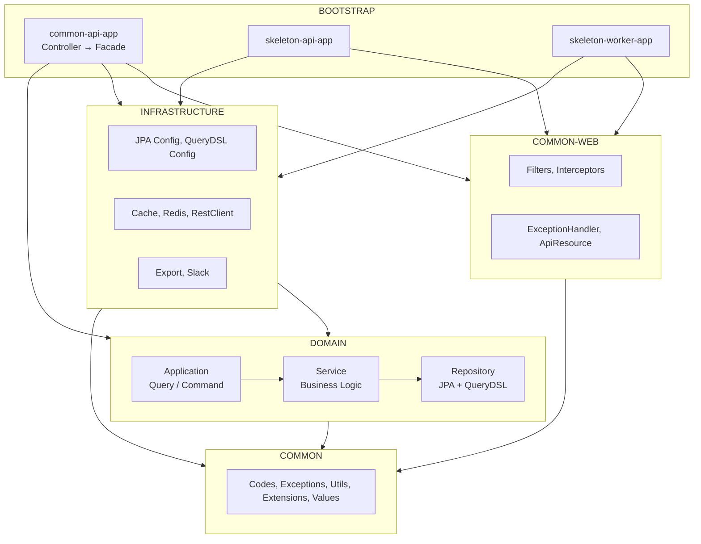
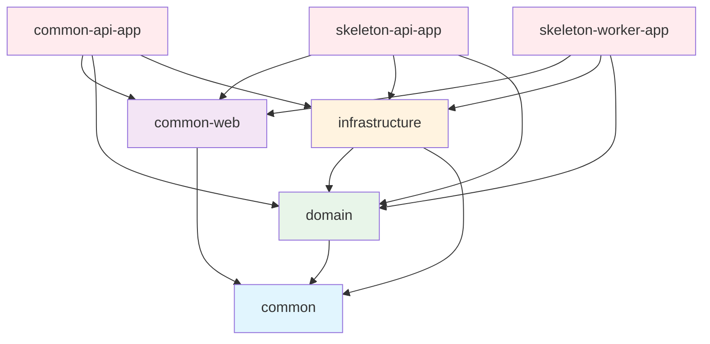

# Project Modules & Architecture

## Architecture

이 프로젝트는 Layered Architecture를 따릅니다.



## Module Structure

```
modules/
├── common/                     # 공통 유틸리티, 예외, 코드, 값 객체
├── common-web/                 # 웹 공통 (Filter, Interceptor, Handler)
├── test-support/               # 테스트 픽스처, REST Docs 지원
├── domain/                     # 도메인 모델, 비즈니스 규칙, JPA Entity, Repository
├── infrastructure/             # Config, Cache, HTTP Client, 외부 서비스
├── bootstrap/                  # Spring Boot 앱 모듈
│   ├── common-api-app/         # 공통 API 서버 (Controller, Facade)
│   ├── skeleton-api-app/       # API 서버
│   └── skeleton-worker-app/    # Worker 서버
└── docs/                       # REST Docs 문서 생성
```

## Module Dependencies



### Dependency Direction Rule

* `bootstrap → domain, infrastructure, common-web`
* `infrastructure → domain, common`
* `domain → common` (only)
* common은 최하위 모듈 (다른 모듈에 의존하지 않음)
* `-app` 모듈은 다른 모듈을 조합하는 역할

## Modules

### common

공통 유틸리티 모듈. 다른 모든 모듈의 기반.

| Package | Purpose |
|---------|---------|
| `codes/` | ResponseCode, ErrorCode, SuccessCode |
| `exceptions/` | BizException, BizRuntimeException, KnownException |
| `values/` | Email, PhoneNumber, Money, Rate 값 객체 |
| `utils/datetime/` | DateFormatter, LocalDateRange, SearchDates |
| `utils/extensions/` | String 마스킹, DateTime 확장 |
| `utils/cipher/` | AES, SEED 암호화 |
| `utils/codec/` | URL 인코딩/디코딩 |
| `utils/coroutine/` | MDC 유지 코루틴 유틸리티 |

### common-web

웹 공통 인프라 모듈.

| Package | Purpose |
|---------|---------|
| `filters/` | AppTraceFilter (UUID v7), ContentCachingFilter |
| `interceptors/` | LogInterceptor, LogResponseBodyInterceptor |
| `handlers/` | GlobalExceptionHandlerV2 |
| `response/` | ApiResource, Status, Meta, PageResponse |
| `aop/` | LogTraceAspect, CheckIpAspect |

### domain

도메인 모델, 비즈니스 규칙, JPA Entity, Repository. common 모듈에만 의존.

| Package | Purpose |
|---------|---------|
| `common/entity/` | BaseEntity, BaseTimeEntity (공통 감사 엔티티) |
| `common/querydsl/` | QuerydslRepositorySupport, QuerydslExpressions (QueryDSL 공통) |
| `{feature}/dto/` | 도메인 DTO (Info, Request, Exception) |
| `{feature}/entity/` | JPA Entity |
| `{feature}/repository/` | JpaRepository, QueryRepository |
| `{feature}/service/` | 비즈니스 로직 |
| `{feature}/application/` | QueryApplication (조회), CommandApplication (생성/수정/삭제) |

#### Request Flow

```
Controller (bootstrap) → Facade (bootstrap)
  → QueryApplication / CommandApplication (domain)
    → Service (domain)
      → JpaRepository / QueryRepository (domain)
```

### infrastructure

기술 구현 모듈. Config, Cache, HTTP Client, 외부 서비스 연동.

| Package | Purpose |
|---------|---------|
| `client/` | RestClientConfig, HttpLoggingInterceptor |
| `cache/` | CacheConfig (Caffeine + Redis) |
| `redis/` | RedisLockAspect, RedisCacheAspect |
| `persistence/config/` | JpaConfig (Auditing), QuerydslConfig |
| `export/` | Excel/CSV 파일 내보내기 (어노테이션 기반, 스타일 프리셋) |
| `slack/` | Slack SDK 기반 알림 (Kotlin DSL 메시지 빌더) |

### bootstrap

Spring Boot Application 모듈.

| Module | Purpose |
|--------|---------|
| `common-api-app` | 공통 API 서버 (Holiday API, 데이터 초기화) |
| `skeleton-api-app` | REST API 서버 (Controllers) |
| `skeleton-worker-app` | Worker 서버 (Scheduled Jobs) |

### test-support

테스트 픽스처와 REST Docs 지원 모듈.

| Package | Purpose |
|---------|---------|
| `IntegratedTestSupport` | 통합 테스트 기반 클래스 |
| `EndPointTestSupport` | API 엔드포인트 테스트 기반 클래스 |
| `RestDocsSupport` | Spring REST Docs Kotlin DSL 지원 |
| `TestTimeRunner` | 테스트 시간 측정 유틸리티 |

### docs

Spring REST Docs 기반 API 문서 생성 모듈.

* Asciidoctor 플러그인으로 HTML 문서 생성
* `common-api-app`, `skeleton-api-app` 테스트에서 생성된 스니펫 수집
* `./gradlew :modules:docs:docs` 명령으로 문서 생성

## Module Naming Convention

* `-app` suffix: Spring Boot executable (bootJar 활성화)
* No suffix: Library module (jar only)

## Package Naming Convention

```
com.myrealtrip.domain.{feature}/
├── dto/
│   ├── {Feature}Info.kt               # Domain DTO
│   ├── Create{Feature}Request.kt      # Domain create request
│   └── {Feature}NotFoundException.kt  # Domain exception
├── entity/
│   └── {Feature}.kt                   # JPA Entity
├── repository/
│   ├── {Feature}JpaRepository.kt      # Spring Data JPA
│   └── {Feature}QueryRepository.kt    # QueryDSL repository
├── service/
│   └── {Feature}Service.kt            # Business logic
└── application/
    ├── {Feature}QueryApplication.kt   # Query use cases
    └── {Feature}CommandApplication.kt # Command use cases

com.myrealtrip.{appname}/
├── api/                # Controllers
├── dto/
│   ├── request/        # API request DTOs
│   └── response/       # API response DTOs
├── facade/             # Facade (DTO conversion + orchestration)
└── config/             # Configuration classes
```

## Creating New Module

### Domain Feature

```
modules/domain/src/main/kotlin/com/myrealtrip/domain/myfeature/
├── dto/
│   ├── MyFeatureInfo.kt               # Domain DTO
│   └── CreateMyFeatureRequest.kt      # Domain request
├── entity/
│   └── MyFeature.kt                   # JPA Entity
├── repository/
│   ├── MyFeatureJpaRepository.kt      # Spring Data JPA
│   └── MyFeatureQueryRepository.kt    # QueryDSL repository
├── service/
│   └── MyFeatureService.kt            # Business logic
└── application/
    ├── MyFeatureQueryApplication.kt   # Query use cases
    └── MyFeatureCommandApplication.kt # Command use cases
```

### Bootstrap App Module

```
modules/bootstrap/my-api-app/
├── build.gradle.kts
└── src/main/kotlin/com/myrealtrip/myapiapp/
    ├── api/
    │   └── MyController.kt
    ├── dto/
    │   ├── request/
    │   │   └── MyApiRequest.kt
    │   └── response/
    │       └── MyApiResponse.kt
    ├── facade/
    │   └── MyFacade.kt
    ├── config/
    │   └── AppConfig.kt
    └── MyApiApplication.kt
```

## HTTP Client Pattern

### @HttpExchange 사용

```kotlin
@HttpExchange("/todos")
interface TodoClient {
    @GetExchange
    fun findAll(): List<TodoDto>

    @GetExchange("/{id}")
    fun findById(@PathVariable id: Int): TodoDto

    @PostExchange
    fun create(@RequestBody todo: TodoDto): TodoDto
}
```

### Client Configuration

```kotlin
@Configuration
@ImportHttpServices(group = "mygroup", types = [TodoClient::class])
class TodoClientConfig {

    @Bean
    fun todoClientGroupConfigurer(): RestClientHttpServiceGroupConfigurer {
        return RestClientHttpServiceGroupConfigurer { groups ->
            groups.filterByName("mygroup")
                .forEachClient { _, builder ->
                    builder.baseUrl("https://api.example.com")
                        .requestInterceptor(HttpLoggingInterceptor("TodoClient"))
                }
        }
    }
}
```

## Response Format

모든 API 응답은 `ApiResource<T>` 형식을 따릅니다.

```kotlin
@GetMapping("/{id}")
fun findById(@PathVariable id: Int): ApiResource<Todo> {
    return ApiResource.success(todoService.findById(id))
}
```

응답 구조:

```json
{
  "status": {
    "status": 200,
    "code": "SUCCESS",
    "message": "Operation successful"
  },
  "meta": {
    "size": 1
  },
  "data": { ... }
}
```

## Exception Handling

### Exception Types

| Exception | Usage | Log Level |
|-----------|-------|-----------|
| `KnownException` | 예상된 에러 (validation, not found) | INFO |
| `BizRuntimeException` | 비즈니스 에러 (처리 불가) | ERROR |
| `BizException` | Checked 비즈니스 예외 | ERROR |

### Custom Exception

```kotlin
class TodoNotFoundException(id: Int) : KnownException(
    ErrorCode.DATA_NOT_FOUND,
    "Todo not found: $id"
)
```

## Caching Strategy

### Two-tier Cache

| Layer | Configuration |
|-------|---------------|
| L1 (Caffeine) | Local memory, 200 items, 30min TTL |
| L2 (Redis) | Distributed, configurable TTL |

### Cache Names

| Name | TTL | MaxIdle | Usage |
|------|-----|---------|-------|
| SHORT_LIVED | 10min | 5min | Search, realtime data |
| DEFAULT | 30min | 10min | General queries |
| MID_LIVED | 1hour | 20min | Infrequently changed data |
| LONG_LIVED | 24hour | 4hour | Code tables, settings |
