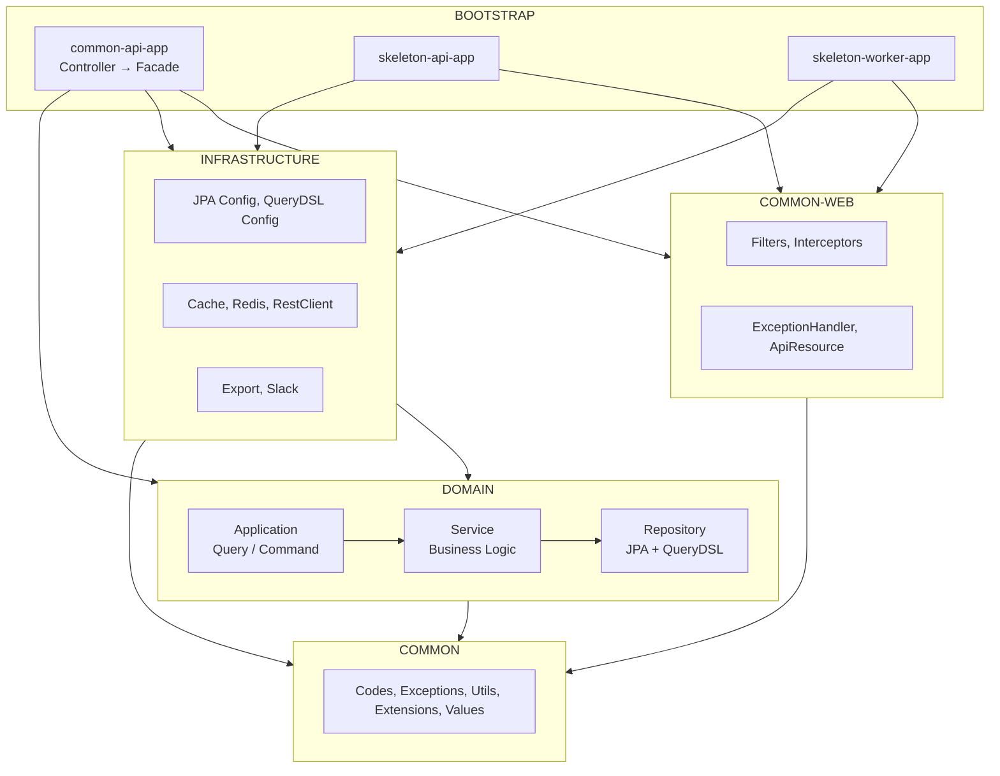
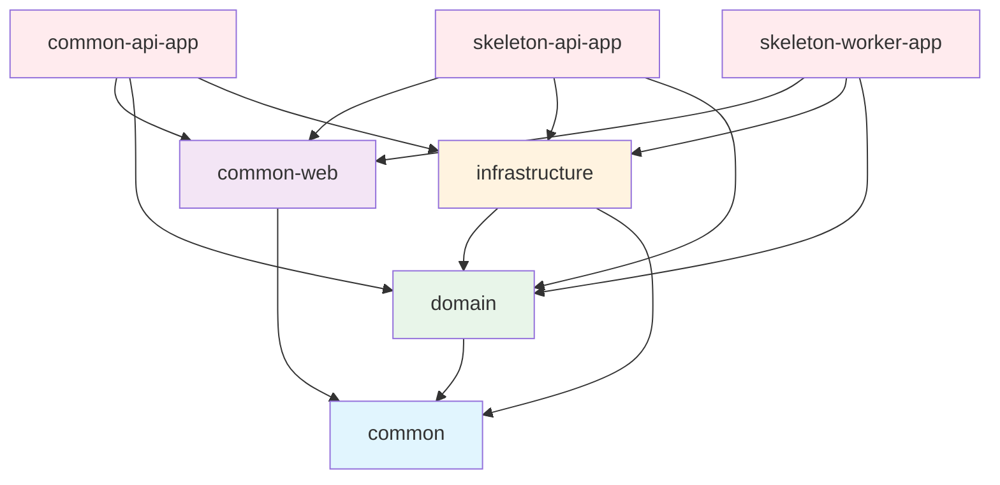

# Project Modules & Architecture

## Overview

This document describes the project's module structure, dependency rules, and conventions for creating new modules.

> **Key Principle**: Dependencies flow in one direction only. Circular and reverse dependencies are prohibited.

## Architecture

This project follows a Layered Architecture.



## Module structure

```
modules/
├── common/                     # Common utilities, exceptions, codes, value objects
├── common-web/                 # Web common (Filter, Interceptor, Handler)
├── test-support/               # Test fixtures, REST Docs support
├── domain/                     # Domain models, business rules, JPA Entity, Repository
├── infrastructure/             # Config, Cache, HTTP Client, external services
├── bootstrap/                  # Spring Boot app modules
│   ├── common-api-app/         # Common API server (Controller, Facade)
│   ├── skeleton-api-app/       # API server
│   └── skeleton-worker-app/    # Worker server
└── docs/                       # REST Docs document generation
```

## Module dependencies



### Dependency Direction Rule

> **IMPORTANT**: All inter-module and inter-package dependencies must be **unidirectional**. Circular and reverse dependencies are prohibited.

* `bootstrap → domain, infrastructure, common-web`
* `infrastructure → domain, common`
* `domain → common` (only)
* `common` is the lowest-level module (depends on no other modules)
* `-app` modules serve as composition roots that assemble other modules
* Within domain: `dto → entity` (DTO knows Entity). Entity must not import DTO

## Modules

### common

Common utility module. Foundation for all other modules.

| Package | Purpose |
|---------|---------|
| `codes/` | ResponseCode, ErrorCode, SuccessCode |
| `exceptions/` | BizException, BizRuntimeException, KnownException |
| `values/` | Email, PhoneNumber, Money, Rate value objects |
| `utils/datetime/` | DateFormatter, LocalDateRange, SearchDates |
| `utils/extensions/` | String masking, DateTime extensions |
| `utils/cipher/` | AES, SEED encryption |
| `utils/codec/` | URL encoding/decoding |
| `utils/coroutine/` | MDC-preserving coroutine utilities |

### common-web

Web common infrastructure module.

| Package | Purpose |
|---------|---------|
| `filters/` | AppTraceFilter (UUID v7), ContentCachingFilter |
| `interceptors/` | LogInterceptor, LogResponseBodyInterceptor |
| `handlers/` | GlobalExceptionHandlerV2 |
| `response/` | ApiResource, Status, Meta, PageResponse |
| `aop/` | LogTraceAspect, CheckIpAspect |

### domain

Domain models, business rules, JPA Entity, Repository. Depends only on the common module.

| Package | Purpose |
|---------|---------|
| `common/entity/` | BaseEntity, BaseTimeEntity (common audit entities) |
| `common/querydsl/` | QuerydslRepositorySupport, QuerydslExpressions (QueryDSL common) |
| `{feature}/dto/` | Domain DTOs (Info, Request, Exception) |
| `{feature}/entity/` | JPA Entity |
| `{feature}/repository/` | JpaRepository, QueryRepository |
| `{feature}/service/` | Business logic |
| `{feature}/application/` | QueryApplication (query), CommandApplication (create/update/delete) |

#### Request Flow

```
Controller (bootstrap) → Facade (bootstrap)
  → QueryApplication / CommandApplication (domain)
    → Service (domain)
      → JpaRepository / QueryRepository (domain)
```

### infrastructure

Technical implementation module. Config, Cache, HTTP Client, external service integration.

| Package | Purpose |
|---------|---------|
| `client/` | RestClientConfig, HttpLoggingInterceptor |
| `cache/` | CacheConfig (Caffeine + Redis) |
| `redis/` | RedisLockAspect, RedisCacheAspect |
| `persistence/config/` | JpaConfig (Auditing), QuerydslConfig, DataSourceConfig (Master-Slave routing) |
| `export/` | Excel/CSV file export (annotation-based, style presets) |
| `slack/` | Slack SDK-based notifications (Kotlin DSL message builder) |

#### DataSource Routing (Master-Slave)

`DataSourceConfig` is activated by `@ConditionalOnProperty(prefix = "spring.datasource.master.hikari", name = ["jdbc-url"])` and provides Master-Slave routing.

| Component | Role |
|-----------|------|
| `DataSourceConfig` | Creates Master/Slave HikariCP pools, auto-activated when property exists |
| `RoutingDataSource` | `@Transactional(readOnly = true)` routes to Slave, otherwise routes to Master |
| `LazyConnectionDataSourceProxy` | Defers connection acquisition until actual query execution to ensure correct routing |

#### DataSource Configuration by Profile

| Profile | DB | DDL Auto | Master Pool | Slave Pool | Redisson |
|---------|-----|----------|-------------|------------|----------|
| `embed, local` | H2 In-Memory (single CP) | `create-drop` | - (max 10) | - | redisson-dev.yml |
| `dev, dev01, dev02` | MySQL Master-Slave | `validate` | max 10, idle 5 | max 10, idle 5 | redisson-dev.yml |
| `test, test01, test02` | MySQL Master-Slave | `validate` | max 10, idle 5 | max 10, idle 5 | redisson-test.yml |
| `stage, prod` | MySQL Master-Slave | `none` | max 20, idle 5 | max 30, idle 10 | redisson-prod.yml |

* `embed, local`: Uses H2 auto-configuration (`DataSourceConfig` bean is not created)
* `dev, test, stage, prod`: `spring.datasource.master.hikari.jdbc-url` exists, activating `DataSourceConfig`
* Aurora MySQL HikariCP settings: `max-lifetime: 840000` (14min, for Aurora DNS failover TTL), `connection-timeout: 3000` (3s)

### bootstrap

Spring Boot Application modules.

| Module | Purpose |
|--------|---------|
| `common-api-app` | Common API server (Holiday API, data initialization) |
| `skeleton-api-app` | REST API server (Controllers) |
| `skeleton-worker-app` | Worker server (Scheduled Jobs) |

### test-support

Test fixtures and REST Docs support module.

| Package | Purpose |
|---------|---------|
| `IntegratedTestSupport` | Integration test base class |
| `EndPointTestSupport` | API endpoint test base class |
| `RestDocsSupport` | Spring REST Docs Kotlin DSL support |
| `TestTimeRunner` | Test execution time measurement utility |

### docs

API document generation module based on Spring REST Docs.

* Generates HTML documents via the Asciidoctor plugin
* Collects snippets generated from `common-api-app` and `skeleton-api-app` tests
* Generate documents with `./gradlew :modules:docs:docs`

## Module naming convention

* `-app` suffix: Spring Boot executable (bootJar enabled)
* No suffix: Library module (jar only)

## Package naming convention

```
com.myrealtrip.domain.{feature}/
├── dto/
│   ├── {Feature}Info.kt               # Domain DTO
│   ├── Create{Feature}Request.kt      # Domain create request
│   └── {Feature}NotFoundException.kt  # Domain exception
├── entity/
│   └── {Feature}.kt                   # JPA Entity
├── repository/
│   ├── {Feature}JpaRepository.kt      # Spring Data JPA
│   └── {Feature}QueryRepository.kt    # QueryDSL repository
├── service/
│   └── {Feature}Service.kt            # Business logic
└── application/
    ├── {Feature}QueryApplication.kt   # Query use cases
    └── {Feature}CommandApplication.kt # Command use cases

com.myrealtrip.{appname}/
├── api/                # Controllers
├── dto/
│   ├── request/        # API request DTOs
│   └── response/       # API response DTOs
├── facade/             # Facade (DTO conversion + orchestration)
└── config/             # Configuration classes
```

## Creating new module

### Domain Feature

```
modules/domain/src/main/kotlin/com/myrealtrip/domain/myfeature/
├── dto/
│   ├── MyFeatureInfo.kt               # Domain DTO
│   └── CreateMyFeatureRequest.kt      # Domain request
├── entity/
│   └── MyFeature.kt                   # JPA Entity
├── repository/
│   ├── MyFeatureJpaRepository.kt      # Spring Data JPA
│   └── MyFeatureQueryRepository.kt    # QueryDSL repository
├── service/
│   └── MyFeatureService.kt            # Business logic
└── application/
    ├── MyFeatureQueryApplication.kt   # Query use cases
    └── MyFeatureCommandApplication.kt # Command use cases
```

### Bootstrap app module

```
modules/bootstrap/my-api-app/
├── build.gradle.kts
└── src/main/kotlin/com/myrealtrip/myapiapp/
    ├── api/
    │   └── MyController.kt
    ├── dto/
    │   ├── request/
    │   │   └── MyApiRequest.kt
    │   └── response/
    │       └── MyApiResponse.kt
    ├── facade/
    │   └── MyFacade.kt
    ├── config/
    │   └── AppConfig.kt
    └── MyApiApplication.kt
```

## HTTP client pattern

### Using @HttpExchange

```kotlin
@HttpExchange("/todos")
interface TodoClient {
    @GetExchange
    fun findAll(): List<TodoDto>

    @GetExchange("/{id}")
    fun findById(@PathVariable id: Int): TodoDto

    @PostExchange
    fun create(@RequestBody todo: TodoDto): TodoDto
}
```

### Client configuration

```kotlin
@Configuration
@ImportHttpServices(group = "mygroup", types = [TodoClient::class])
class TodoClientConfig {

    @Bean
    fun todoClientGroupConfigurer(): RestClientHttpServiceGroupConfigurer {
        return RestClientHttpServiceGroupConfigurer { groups ->
            groups.filterByName("mygroup")
                .forEachClient { _, builder ->
                    builder.baseUrl("https://api.example.com")
                        .requestInterceptor(HttpLoggingInterceptor("TodoClient"))
                }
        }
    }
}
```

## Response format

All API responses follow the `ApiResource<T>` format.

```kotlin
@GetMapping("/{id}")
fun findById(@PathVariable id: Int): ApiResource<Todo> {
    return ApiResource.success(todoService.findById(id))
}
```

Response structure:

```json
{
  "status": {
    "status": 200,
    "code": "SUCCESS",
    "message": "Operation successful"
  },
  "meta": {
    "size": 1
  },
  "data": { ... }
}
```

## Exception handling

### Exception types

| Exception | Usage | Log Level |
|-----------|-------|-----------|
| `KnownException` | Expected errors (validation, not found) | INFO |
| `BizRuntimeException` | Business errors (unrecoverable) | ERROR |
| `BizException` | Checked business exceptions | ERROR |

### Custom exception

```kotlin
class TodoNotFoundException(id: Int) : KnownException(
    ErrorCode.DATA_NOT_FOUND,
    "Todo not found: $id"
)
```

## Caching strategy

### Two-tier cache

| Layer | Configuration |
|-------|---------------|
| L1 (Caffeine) | Local memory, 200 items, 30min TTL |
| L2 (Redis) | Distributed, configurable TTL |

### Cache names

| Name | TTL | MaxIdle | Usage |
|------|-----|---------|-------|
| SHORT_LIVED | 10min | 5min | Search, realtime data |
| DEFAULT | 30min | 10min | General queries |
| MID_LIVED | 1hour | 20min | Infrequently changed data |
| LONG_LIVED | 24hour | 4hour | Code tables, settings |
