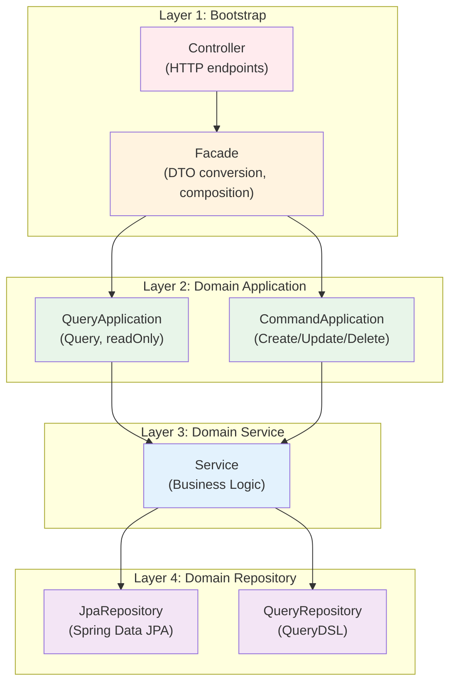
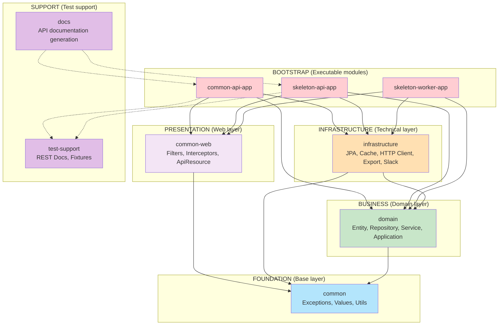

# Project Overview

## Overview

This document describes the purpose, technical stack, and architectural principles of the Spring Boot + Kotlin sample skeleton project. Use this documentation to understand the project's structure, core technologies, and design decisions.

---

## Project Purpose

This project provides a **standard skeleton for Spring Boot + Kotlin based microservice development**.

### Core Objectives

The project delivers four core benefits:

1. **Reusable Template**: Provides a standard structure you can use immediately when you start new Spring Boot projects.
2. **Best Practices Applied**: Implements Clean Code, SOLID principles, and Layered Architecture.
3. **Productivity Enhancement**: Includes common utilities, standardized response format, and automatic REST Docs generation.
4. **Scalable Structure**: Uses multi-module architecture to support independent feature-based expansion.

### Use Cases

Use this skeleton for the following applications:

- RESTful API server development
- Worker/Batch applications
- Domain-Driven Design (DDD) based microservices
- Enterprise-grade backend systems

---

## Tech Stack

### Core Technologies

| Category | Technology | Version | Purpose |
|---------|------|------|------|
| **Language** | Kotlin | 2.3.10 | Primary development language |
| **Framework** | Spring Boot | 4.0.2 | Application framework |
| **JVM** | Java | 25 | Runtime environment |
| **Build Tool** | Gradle | 9.2.1 | Build and dependency management |

### Major Libraries

#### Data Access

| Library | Version | Purpose |
|-----------|------|------|
| Spring Data JPA | 4.0.2 | ORM, database abstraction |
| QueryDSL | 7.1 | Type-safe query builder |
| HikariCP | Included | Connection pool |
| H2 Database | Latest | In-memory DB for dev/test |
| MySQL Connector | Latest | Production DB driver |

#### Caching

| Library | Version | Purpose |
|-----------|------|------|
| Caffeine | Latest | L1 local cache |
| Redisson | 4.2.0 | L2 distributed cache (Redis client) |
| LZ4 | 1.10.3 | Cache data compression |

#### HTTP Client & API

| Library | Version | Purpose |
|-----------|------|------|
| Spring RestClient | 4.0.2 | Declarative HTTP client (@HttpExchange) |
| SpringDoc OpenAPI | 3.0.1 | OpenAPI 3.0 spec generation (Swagger UI) |
| Spring REST Docs | Latest | Test-based API documentation auto-generation |

#### External Service Integration

| Library | Version | Purpose |
|-----------|------|------|
| Slack API Client | 1.47.0 | Slack notification delivery |
| Apache POI | 5.5.1 | Excel/CSV file generation |
| libphonenumber | 9.0.23 | Phone number parsing/validation |

#### Testing

| Library | Version | Purpose |
|-----------|------|------|
| Kotest | 6.1.3 | BDD-style testing framework |
| AssertJ | Included | Fluent assertion library |
| Mockito Kotlin | 5.4.0 | Mocking library |
| MockK | 1.14.9 | Kotlin native mocking |

#### Monitoring & Tracing

| Library | Version | Purpose |
|-----------|------|------|
| Micrometer | Latest | Metrics collection |
| Brave (Zipkin) | Latest | Distributed tracing |
| Spring Actuator | 4.0.2 | Health checks, metrics endpoints |

#### Utilities

| Library | Version | Purpose |
|-----------|------|------|
| Jackson Kotlin Module | Latest | JSON serialization/deserialization |
| Kotlin Coroutines | 1.10.2 | Asynchronous processing |
| kotlin-logging | 7.0.13 | Kotlin-friendly logging |
| Lombok | Latest | Boilerplate code elimination (Java compatibility) |

---

## Architecture Overview

### Layered Architecture (4-Layer)

The project consists of 4 layers with **unidirectional dependencies**.



### Module Structure



### Dependency Direction Principles

> **Core Principle**: All dependencies flow downward in one direction. The system prohibits reverse dependencies.

```
Bootstrap → Common-Web → Common
    ↓
Infrastructure → Domain → Common
    ↓
Domain (internal)
```

| Dependency Direction | Allowed | Prohibited |
|----------|------|------|
| Bootstrap → Domain | ✅ | Domain → Bootstrap ❌ |
| Infrastructure → Domain | ✅ | Domain → Infrastructure ❌ |
| Domain → Common | ✅ | Common → Domain ❌ |
| DTO → Entity | ✅ | Entity → DTO ❌ |

---

## Module Summary

### Bootstrap (Executable Modules)

Bootstrap modules are executable Spring Boot applications (`bootJar` enabled).

| Module | Role | Key Components |
|------|------|--------------|
| **common-api-app** | Common API server | HolidayController, data initialization |
| **skeleton-api-app** | Main API server | REST API Controllers |
| **skeleton-worker-app** | Worker/Batch server | Scheduled Jobs |

**Features:**

- Contains `@SpringBootApplication` entry point
- Includes `Controller` and `Facade` components
- Defines API Request/Response DTOs
- Composes other modules to build executable applications

### Common-Web (Web Commons)

Common-Web provides Spring MVC-based web common infrastructure.

**Key Components:**

- **Filters**: AppTraceFilter (UUID v7 trace ID), ContentCachingFilter
- **Interceptors**: LogInterceptor, LogResponseBodyInterceptor
- **Exception Handler**: GlobalExceptionHandlerV2
- **Response**: ApiResource, Status, Meta, PageResponse
- **AOP**: LogTraceAspect, CheckIpAspect (IP whitelist)
- **OpenAPI**: Swagger common configuration

### Domain

Domain is the core layer for business logic and data models.

**Package Structure:**
```
domain/
├── common/
│   ├── entity/          # BaseEntity, BaseTimeEntity
│   └── querydsl/        # QuerydslRepositorySupport, QuerydslExpressions
└── {feature}/
    ├── dto/             # Info, Request, Exception
    ├── entity/          # JPA Entity
    ├── repository/      # JpaRepository, QueryRepository
    ├── service/         # Business logic
    └── application/     # QueryApplication, CommandApplication
```

**Features:**

- Depends only on `common` module (isolation guaranteed)
- Maintains unidirectional dependency: Entity does not know DTO
- Manages `@Transactional` only at Application level

### Infrastructure

Infrastructure handles technical concerns and external system integration.

**Key Components:**

| Package | Role |
|--------|------|
| `persistence/config/` | JpaConfig, QuerydslConfig, DataSourceConfig (Master-Slave routing) |
| `cache/` | 2-tier cache (Caffeine L1 + Redis L2) |
| `client/` | RestClient configuration, HTTP logging interceptor |
| `export/` | Excel/CSV file generation (annotation-based) |
| `slack/` | Slack SDK-based notification delivery (Kotlin DSL) |
| `redis/` | RedisLockAspect, RedisCacheAspect |

**DataSource Routing:**

- `@Transactional(readOnly = true)` routes to Slave (Reader)
- `@Transactional` (default) routes to Master (Writer)
- `LazyConnectionDataSourceProxy` delays connection acquisition

### Common (Common Foundation)

Common is the lowest-level utility module. All project modules use Common.

**Key Components:**

| Package | Contents |
|--------|------|
| `codes/` | ResponseCode, ErrorCode, SuccessCode |
| `exceptions/` | KnownException, BizRuntimeException, BizException |
| `values/` | Email, PhoneNumber, Money, Rate (value objects) |
| `utils/datetime/` | DateFormatter, LocalDateRange, SearchDates |
| `utils/extensions/` | String masking, DateTime extension functions |
| `utils/cipher/` | AES, SEED encryption |
| `utils/codec/` | URL encoding/decoding |
| `utils/coroutine/` | MDC-preserving coroutine utilities |

**Features:**

- Contains minimal external dependencies (only libphonenumber)
- Has no dependencies on other modules (lowest layer)
- Provides value objects for type safety

### Test-Support

Test-Support provides test fixtures and REST Docs support.

**Key Classes:**

- `RestDocsSupport`: Spring REST Docs Kotlin DSL
- `IntegratedTestSupport`: Integration test base class
- `EndPointTestSupport`: API endpoint testing
- `TestTimeRunner`: Test time measurement

### Docs (Documentation Generation)

Docs generates API documentation using Asciidoctor.

**Build Command:**
```bash
./gradlew :modules:docs:docs
```

**Generation Process:**

1. Run DocsTest to generate snippets (`build/generated-snippets`)
2. Asciidoctor plugin generates HTML
3. Save results to `build/docs/asciidoc/` directory

---

## Core Design Principles

### 1. Unidirectional Dependencies

All modules and layers maintain **downward unidirectional dependencies**.

```
Upper layer → Lower layer (O)
Lower layer → Upper layer (X)
```

**Examples:**

- ✅ `HolidayDto.from(holidayInfo)` - API DTO knows Domain DTO
- ✅ `HolidayInfo.from(entity)` - Domain DTO knows Entity
- ❌ `entity.toDto()` - Entity should not know DTO (reverse dependency)

### 2. CQRS-lite (Query/Command Separation)

The Application layer separates read and write operations.

| Type | Annotation | Role | Routing |
|------|-----------|------|--------|
| **QueryApplication** | `@Transactional(readOnly = true)` | Read-only | Slave (Reader) |
| **CommandApplication** | `@Transactional` | Create/Update/Delete | Master (Writer) |

### 3. DTO Conversion Strategy

DTO conversion between layers follows clear separation of responsibilities.

```
[HTTP JSON]
    ↓ deserialize
API Request DTO (Bootstrap)
    ↓ Controller conversion (simple constructor call)
Domain Request DTO (Domain)
    ↓ Service business logic
Entity (Domain)
    ↓ Info.from(entity) - Service conversion
Domain Info DTO (Domain)
    ↓ Facade conversion (ApiDto.from())
API Response DTO (Bootstrap)
    ↓ ApiResource.success() wrapping
[HTTP JSON]
```

**Rules:**

- Controller does not handle Entity directly
- Facade does not handle Entity directly
- Service does not know API DTOs

### 4. Transaction Management

The system declares `@Transactional` **only at the Application level**.

| Layer | Transaction | Reason |
|-------|---------|------|
| Controller | ❌ | HTTP layer does not manage transactions |
| Facade | ❌ | Only performs DTO conversion; transaction unnecessary |
| Application | ✅ | Defines transaction boundaries |
| Service | ❌ | Transaction propagates from Application (prevents duplication) |

### 5. Value Objects Usage

Use type-safe value objects instead of primitives.

| Primitive Type | Value Object | Benefits |
|----------|---------|------|
| `String` | `Email` | Automatic validation, masking |
| `String` | `PhoneNumber` | Auto parsing/formatting, country code |
| `BigDecimal` + `String` | `Money` | Includes currency, type-safe operations |
| `Double` / `BigDecimal` | `Rate` | Clear percentage representation |

**Creation Examples:**
```kotlin
val email = "user@example.com".asEmail
val phone = "010-1234-5678".asPhoneNumber
val money = 10000L.krw
val rate = 15.percent
```

### 6. Exception Handling Strategy

| Exception Type | Purpose | Stack Trace | Log Level |
|----------|------|--------------|----------|
| `KnownException` | Expected errors (validation, not found) | ❌ | INFO |
| `BizRuntimeException` | Business errors (unrecoverable) | ✅ | ERROR |
| `BizException` | Checked business exception | ✅ | ERROR |

**Precondition Validation:**
```kotlin
// Use knownRequired instead of require (throws KnownException)
knownRequired(amount > 0) { "Amount must be positive" }

val user = knownRequiredNotNull(repository.findById(id)) {
    "User not found: $id"
}
```

### 7. REST API Response Standard

All APIs respond with `ApiResource<T>` format.

**Response Structure:**
```json
{
  "status": {
    "status": 200,
    "code": "SUCCESS",
    "message": "Operation successful"
  },
  "meta": {
    "size": 1
  },
  "data": { ... }
}
```

**Controller Example:**
```kotlin
@GetMapping("/{id}")
fun findById(@PathVariable id: Long): ResponseEntity<ApiResource<UserDto>> =
    ApiResource.success(userFacade.findById(id))
```

### 8. QueryDSL Standards

Use QueryDSL for dynamic queries and complex retrieval.

**Rules:**

- Extend `QuerydslRepositorySupport`
- Use `fetch` prefix for method names
- Use `@QueryProjection` annotation for DTO creation (type safety)
- Use `applyPagination` method for pagination

**Example:**
```kotlin
@Repository
class OrderQueryRepository : QuerydslRepositorySupport(Order::class.java) {

    fun fetchById(id: Long): OrderDto? {
        return select(QOrderDto(order.id, order.totalAmount))
            .from(order)
            .where(order.id.eq(id))
            .fetchOne()
    }
}
```

---

## Build and Execution

### Build Commands

```bash
# Full build
./gradlew build

# Build specific module
./gradlew :modules:common-api-app:build

# Clean build
./gradlew cleanBuild

# Build without tests
./gradlew build -x test
```

### Test Commands

```bash
# All tests
./gradlew test

# Specific module tests
./gradlew :modules:domain:test

# Specific class test
./gradlew test --tests "com.myrealtrip.domain.holiday.HolidayServiceTest"

# Generate test report
./gradlew testReport
```

### Application Execution

```bash
# Run common-api-app
./gradlew :modules:bootstrap:common-api-app:bootRun

# Run skeleton-api-app
./gradlew :modules:bootstrap:skeleton-api-app:bootRun

# Run skeleton-worker-app
./gradlew :modules:bootstrap:skeleton-worker-app:bootRun
```

### REST Docs Generation

```bash
# Generate API documentation (test → snippets → HTML)
./gradlew :modules:docs:docs
```

### Profile Configuration

| Profile | Database | DDL Mode | Purpose |
|---------|------------|---------|------|
| `embed`, `local` | H2 In-Memory | `create-drop` | Local development |
| `dev`, `dev01`, `dev02` | MySQL Master-Slave | `validate` | Development server |
| `test`, `test01`, `test02` | MySQL Master-Slave | `validate` | Test server |
| `stage` | MySQL Master-Slave | `none` | Staging server |
| `prod` | MySQL Master-Slave | `none` | Production server |

**Execution Example:**
```bash
./gradlew :modules:bootstrap:common-api-app:bootRun --args='--spring.profiles.active=local'
```

---

## Project Information

| Item | Value |
|------|-----|
| **Group** | com.myrealtrip |
| **Artifact** | spring-skeleton |
| **Version** | Managed (gradle.properties) |
| **Java Version** | 25 |
| **Kotlin Version** | 2.3.10 |
| **Spring Boot Version** | 4.0.2 |
| **Gradle Version** | 9.2.1 |

---

## Related Documents

- [01-module-dependency.md](01-module-dependency.md) - Detailed module dependency structure
- [02-layer-architecture.md](02-layer-architecture.md) - Layer architecture rules
- [03-error-handling.md](03-error-handling.md) - Exception handling strategy
- [04-caching-strategy.md](04-caching-strategy.md) - Caching strategy
- [05-http-client-patterns.md](05-http-client-patterns.md) - HTTP client patterns
- [06-cross-cutting-concerns.md](06-cross-cutting-concerns.md) - AOP, filters, interceptors
- [07-api-response-format.md](07-api-response-format.md) - API response format
- [08-new-module-guide.md](08-new-module-guide.md) - New module creation guide
