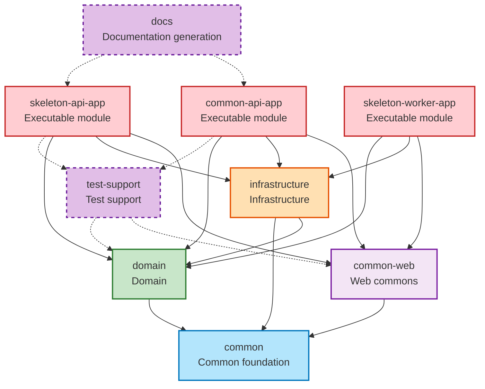

# Module Dependency Structure

## Overview

This document describes the multi-module architecture dependency rules, module responsibilities, and package organization. The project enforces strict unidirectional dependencies to maintain clear boundaries between concerns.

---

## Core Principles

> **Unidirectional Dependencies**: All inter-module dependencies flow downward in one direction. The system prohibits circular and reverse dependencies.

**Dependency Hierarchy:**
```
Bootstrap (Top)
    ↓
Common-Web, Infrastructure
    ↓
Domain
    ↓
Common (Bottom)
```

---

## Complete Module Dependency Graph



---

## Module Details

### 1. Common (Common Foundation)

**Location:** `modules/common`

**Role:** Common provides the lowest-level utility module for the entire project.

**Dependencies:**

- External: `libphonenumber` (phone number handling)
- Project modules: **None** (lowest layer)

**Key Packages:**

- `codes/`: ResponseCode, ErrorCode, SuccessCode
- `exceptions/`: BizException, BizRuntimeException, KnownException
- `values/`: Email, PhoneNumber, Money, Rate (value objects)
- `utils/datetime/`: DateFormatter, LocalDateRange, SearchDates
- `utils/extensions/`: String masking, DateTime extensions
- `utils/cipher/`: AES, SEED encryption
- `utils/codec/`: URL encoding/decoding
- `utils/coroutine/`: MDC-preserving coroutines

**Key Features:**

- **Value Objects**: Type-safe domain values (Email, PhoneNumber, Money, Rate)
- **Exception Hierarchy**: Layer-specific exception classes (Known, Biz, BizRuntime)
- **Date/Time Utils**: Parsing, formatting, range validation
- **String Masking**: Privacy protection masking functions
- **Encryption**: AES, SEED encryption/decryption

**Dependency Prohibitions:**

- ❌ No dependencies on other project modules
- ❌ No Spring Framework dependencies (pure Kotlin/Java)
- ❌ No heavy libraries like JPA or Jackson

---

### 2. Domain

**Location:** `modules/domain`

**Role:** Domain contains the core business logic and data models.

**Dependencies:**

- Project modules: `common` (only)
- External: Spring Data JPA, QueryDSL, Hibernate

**Package Structure:**
```
domain/
├── common/entity/          # BaseEntity, BaseTimeEntity
├── common/querydsl/        # QuerydslRepositorySupport, QuerydslExpressions
└── {feature}/
    ├── dto/                # Info, Request, Exception
    ├── entity/             # JPA Entity
    ├── repository/         # JpaRepository, QueryRepository
    ├── service/            # Business logic
    └── application/        # QueryApplication, CommandApplication
```

**Layer Structure (Domain Internal):**
```
Application (Query/Command) → Service → Repository → Entity
```

**Dependency Rules:**

- ✅ Depends only on `common` module
- ❌ No dependencies on `infrastructure`, `common-web`, or `bootstrap`
- ✅ DTOs can import Entity (`Info.from(entity)`)
- ❌ Entity cannot import DTO (prevents reverse dependency)

**Transaction Management:**

- `QueryApplication`: Uses `@Transactional(readOnly = true)` for Slave DB routing
- `CommandApplication`: Uses `@Transactional` for Master DB routing
- `Service`: Has no transaction annotation (transaction propagates from Application)

**QueryDSL Rules:**

- Use `QueryRepository` suffix
- Extend `QuerydslRepositorySupport`
- Use `fetch` prefix for method names
- Use `@QueryProjection` for type-safe DTO creation

---

### 3. Infrastructure

**Location:** `modules/infrastructure`

**Role:** Infrastructure handles technical concerns and external system integration.

**Dependencies:**

- Project modules: `domain`, `common`
- External: Spring Boot, Caffeine, Redisson, Apache POI, Slack SDK

**Key Packages:**

- `persistence/config/`: JPA, QueryDSL, DataSource configuration (Master-Slave routing)
- `cache/`: Caffeine + Redis 2-tier cache
- `redis/`: Redisson, distributed locks, cache AOP
- `client/`: RestClient, HTTP logging
- `export/`: Excel/CSV file generation
- `slack/`: Slack message delivery (Kotlin DSL)

**Key Features:**

#### DataSource Routing (Master-Slave)

```kotlin
// QueryApplication → Slave
@Service
@Transactional(readOnly = true)
class HolidayQueryApplication { ... }

// CommandApplication → Master
@Service
@Transactional
class HolidayCommandApplication { ... }
```

**Routing Mechanism:**

1. System checks `@Transactional(readOnly = true)` annotation
2. `RoutingDataSource` reads readOnly flag of current transaction
3. `LazyConnectionDataSourceProxy` delays connection acquisition until actual SQL execution
4. System routes readOnly = true to Slave, otherwise to Master

#### 2-Tier Cache Strategy

| Level | Implementation | Features |
|------|------|------|
| **L1** | Caffeine | Local memory, 200 items, 30min TTL |
| **L2** | Redisson (Redis) | Distributed cache, custom TTL |

**Cache Naming Convention:**

- `SHORT_LIVED`: 10min TTL (real-time data, search results)
- `DEFAULT`: 30min TTL (general queries)
- `MID_LIVED`: 1hour TTL (infrequently changed data)
- `LONG_LIVED`: 24hour TTL (code tables, settings)

#### HTTP Client (@HttpExchange)

```kotlin
@HttpExchange("/todos")
interface TodoClient {
    @GetExchange
    fun findAll(): List<TodoDto>

    @GetExchange("/{id}")
    fun findById(@PathVariable id: Int): TodoDto
}
```

**Features:**

- Declarative HTTP client (Spring 6.1+)
- Automatic request/response logging with `HttpLoggingInterceptor`
- Group-based configuration (`RestClientHttpServiceGroupConfigurer`)

---

### 4. Common-Web

**Location:** `modules/common-web`

**Role:** Common-Web provides Spring MVC-based web common infrastructure.

**Dependencies:**

- Project modules: `common`
- External: Spring Web MVC, SpringDoc OpenAPI, Micrometer

**Key Packages:**

- `filters/`: AppTraceFilter (UUID v7), ContentCachingFilter
- `interceptors/`: LogInterceptor, LogResponseBodyInterceptor
- `handlers/`: GlobalExceptionHandlerV2
- `response/`: ApiResource, PageResponse, Status, Meta
- `aop/`: LogTraceAspect, CheckIpAspect (IP whitelist)
- `openapi3/`: Swagger common configuration
- `async/`: AsyncConfig, MdcTaskDecorator
- `utils/`: MDC, IP, HttpServlet, Environment utilities

**Filter Chain Order:**

1. `AppTraceFilter` (Trace ID generation) - Order: -100
2. `ContentCachingFilter` (Request/response caching) - Order: -90
3. Spring Security Filter (if present)
4. Other filters

**Interceptor Order:**

1. `LogInterceptor` (Request logging) - Order: 0
2. `LogResponseBodyInterceptor` (Response logging) - Order: 100

**ApiResource Response Structure:**
```json
{
  "status": {
    "status": 200,
    "code": "SUCCESS",
    "message": "Operation successful"
  },
  "meta": {
    "size": 1
  },
  "data": { ... }
}
```

---

### 5. Bootstrap (Executable Modules)

**Location:** `modules/bootstrap/`

**Role:** Bootstrap provides executable Spring Boot applications.

**Common Features:**

- `bootJar` enabled (executable JAR)
- `@SpringBootApplication` entry point
- Composes other modules to build complete applications

#### 5.1 common-api-app

**Key Features:** Holiday API, health checks, initial data loading

**Packages:** api (Controller), facade, dto (request/response), config, init

#### 5.2 skeleton-api-app

**Purpose:** Main API server (project-specific customization)

**Packages:** api, facade, dto, config

#### 5.3 skeleton-worker-app

**Purpose:** Worker/Batch server (scheduling, async tasks)

**Packages:** job (@Scheduled), config

---

### 6. Test-Support

**Role:** Test-Support provides test fixtures and REST Docs support.

**Key Classes:**

- `RestDocsSupport`: REST Docs base class, Kotlin DSL
- `IntegratedTestSupport`: Integration test base class
- `EndPointTestSupport`: API endpoint testing
- `DocsFieldType`: Field types (DATE, DATETIME, ENUM)

### 7. Docs (Documentation Generation)

**Role:** Docs generates API documentation using Asciidoctor.

**Build Command:**
```bash
./gradlew :modules:docs:docs
```

**Process:** Run DocsTest to generate snippets, then convert to HTML

---

## Dependency Rules Summary

### Allowed Dependency Directions

| From | To | Description |
|------|-----|------|
| Bootstrap | Common-Web, Infrastructure, Domain | ✅ Executable modules use all layers |
| Common-Web | Common | ✅ Web commons use only foundation utilities |
| Infrastructure | Domain, Common | ✅ Infrastructure uses domain + foundation |
| Domain | Common | ✅ Domain uses only foundation |
| Common | (none) | ✅ Foundation is independent |

### Prohibited Dependency Directions

| From | To | Reason |
|------|-----|------|
| Common | Domain, Infrastructure, Common-Web | ❌ Foundation is lowest layer |
| Domain | Infrastructure, Common-Web | ❌ Domain is technology-independent |
| Domain | Bootstrap | ❌ Reverse dependency |
| Infrastructure | Bootstrap | ❌ Reverse dependency |
| Common-Web | Bootstrap | ❌ Reverse dependency |

### Domain Internal Dependency Rules

| Dependency Direction | Allowed | Description |
|----------|------|------|
| DTO → Entity | ✅ | Use `HolidayInfo.from(entity)` pattern |
| Entity → DTO | ❌ | Prohibit `entity.toInfo()` (reverse) |
| Application → Service | ✅ | Application calls Service |
| Service → Application | ❌ | Prevent circular dependency |
| Service → Repository | ✅ | Service calls Repository |

---

## New Module Checklist

### 1. Verify Dependencies

- [ ] Do dependent modules follow allowed direction?
- [ ] Are there no circular dependencies?
- [ ] Have you added only minimal dependencies?

### 2. Naming Convention

- [ ] Bootstrap modules: Use `*-app` suffix
- [ ] Library modules: Use no suffix
- [ ] Package name: Use `com.myrealtrip.{modulename}`

### 3. build.gradle.kts Configuration

```kotlin
// Bootstrap module
apply(plugin = "org.springframework.boot")

dependencies {
    implementation(project(":modules:common-web"))
    implementation(project(":modules:infrastructure"))
    implementation(project(":modules:domain"))
}

// Library module
dependencies {
    // Only minimal necessary dependencies
}
```

### 4. settings.gradle.kts Registration

```kotlin
include("modules:my-new-module")
```

---

## Inter-Module Communication Pattern

```
Controller (Bootstrap) → Facade (Bootstrap)
    ↓
QueryApplication / CommandApplication (Domain)
    ↓
Service (Domain)
    ↓
Repository (Domain)
```

**Layer Responsibilities:**

- **Controller**: HTTP mapping, request validation
- **Facade**: API DTO ↔ Domain DTO conversion, Application composition
- **Application**: Transaction boundary management, Service delegation
- **Service**: Business logic, Entity → DTO conversion
- **Repository**: Data access

**Reference:** See `92_layer-architecture.md` for detailed implementation examples

---

## Related Documents

- [00-overview.md](00-overview.md) - Project overview
- [02-layer-architecture.md](02-layer-architecture.md) - Layer architecture details
- [../../.claude/rules/92_layer-architecture.md](../../.claude/rules/92_layer-architecture.md) - Detailed layer architecture rules
