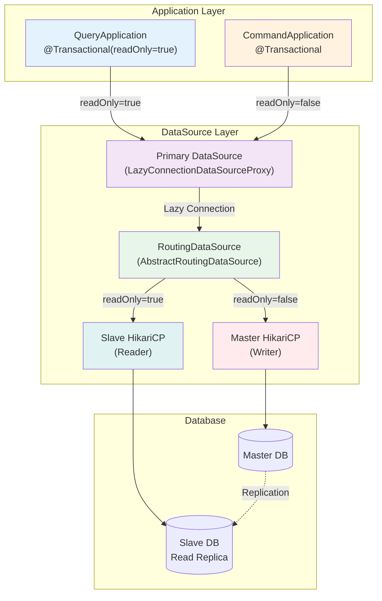

# DataSource Routing (Master/Slave)

## Overview

This document explains how the project automatically distributes read and write workloads across Master and Slave databases. The system routes connections based on the `@Transactional(readOnly = true)` annotation.

## Core Principle

### Routing Rules

| Transaction Type | Routed To | Purpose |
|------------------|-----------|---------|
| `@Transactional(readOnly = true)` | **Slave** (Reader) | SELECT (read-only) |
| `@Transactional` (default) | **Master** (Writer) | INSERT, UPDATE, DELETE |
| No transaction | **Master** (default) | Non-transactional operations |

### How Routing Works

```
@Transactional annotation entry
  → Spring sets the readOnly flag
    → LazyConnectionDataSourceProxy delays connection acquisition until SQL execution
      → AbstractRoutingDataSource checks readOnly flag and routes to Master or Slave
```

## Architecture Diagram



## Core Components

### 1. DataSourceConfig

DataSourceConfig creates the Master and Slave DataSources and configures the routing logic.

```kotlin
@Configuration
@ConditionalOnProperty(prefix = "spring.datasource.master.hikari", name = ["jdbc-url"])
class DataSourceConfig {

    @Bean(MASTER_DATA_SOURCE)
    @ConfigurationProperties("spring.datasource.master.hikari")
    fun masterDataSource(): DataSource =
        DataSourceBuilder.create().build()

    @Bean(SLAVE_DATA_SOURCE)
    @ConfigurationProperties("spring.datasource.slave.hikari")
    fun slaveDataSource(): DataSource =
        DataSourceBuilder.create().build()

    @Bean
    fun routingDataSource(
        @Qualifier(MASTER_DATA_SOURCE) masterDataSource: DataSource,
        @Qualifier(SLAVE_DATA_SOURCE) slaveDataSource: DataSource,
    ): DataSource {
        val routingDataSource = object : AbstractRoutingDataSource() {
            override fun determineCurrentLookupKey(): Any =
                if (TransactionSynchronizationManager.isCurrentTransactionReadOnly())
                    SLAVE
                else
                    MASTER
        }

        routingDataSource.setTargetDataSources(
            mapOf<Any, Any>(
                MASTER to masterDataSource,
                SLAVE to slaveDataSource,
            ),
        )
        routingDataSource.setDefaultTargetDataSource(masterDataSource)

        return routingDataSource
    }

    @Primary
    @Bean
    fun dataSource(
        @Qualifier("routingDataSource") routingDataSource: DataSource,
    ): DataSource =
        LazyConnectionDataSourceProxy(routingDataSource)
}
```

**Key Points:**

- `@ConditionalOnProperty`: Activates only when the `spring.datasource.master.hikari.jdbc-url` property exists
- `determineCurrentLookupKey()`: Checks the readOnly flag from `TransactionSynchronizationManager`
- `setDefaultTargetDataSource()`: Uses Master as the default when no transaction context exists

### 2. LazyConnectionDataSourceProxy

**Role**: LazyConnectionDataSourceProxy delays connection acquisition until the application executes actual SQL.

```kotlin
@Primary
@Bean
fun dataSource(
    @Qualifier("routingDataSource") routingDataSource: DataSource,
): DataSource =
    LazyConnectionDataSourceProxy(routingDataSource)
```

**Why LazyConnectionDataSourceProxy Is Required**

Spring AOP starts the transaction at method entry. Without `LazyConnectionDataSourceProxy`, the routing fails:

1. Spring starts the transaction → HikariCP immediately acquires a connection (before Spring sets the readOnly flag)
2. Spring sets the readOnly flag
3. The application executes SQL (but the connection already came from the wrong DataSource)

LazyConnectionDataSourceProxy delays connection acquisition until actual SQL execution. Spring sets the readOnly flag before HikariCP acquires the connection, ensuring correct routing.

### 3. AbstractRoutingDataSource

**Role**: AbstractRoutingDataSource selects the Master or Slave DataSource based on the readOnly flag.

```kotlin
val routingDataSource = object : AbstractRoutingDataSource() {
    override fun determineCurrentLookupKey(): Any =
        if (TransactionSynchronizationManager.isCurrentTransactionReadOnly()) SLAVE else MASTER
}
```

The system calls `determineCurrentLookupKey()` whenever HikariCP needs a connection. The method checks the current transaction's readOnly state.

## Profile-Specific Configuration

### embed, local (H2 In-Memory)

Master/Slave routing is **disabled** in local development.

```yaml
spring:
  datasource:
    url: jdbc:h2:mem:testdb
    username: sa
    password:
    hikari:
      maximum-pool-size: 10
```

- The configuration omits the `master.hikari.jdbc-url` property, so `@ConditionalOnProperty` prevents Spring Boot from creating the `DataSourceConfig` bean
- Spring Boot Auto-Configuration creates a single H2 DataSource

### dev, dev01, dev02 (Development)

```yaml
spring:
  datasource:
    master:
      hikari:
        jdbc-url: ${DB_MASTER_URL}
        username: ${DB_USERNAME}
        password: ${DB_PASSWORD}
        driver-class-name: com.mysql.cj.jdbc.Driver
        pool-name: "${spring.application.name}-master-cp"
        maximum-pool-size: 10
        minimum-idle: 5
        connection-timeout: 3000
        idle-timeout: 300000
        max-lifetime: 840000
        validation-timeout: 1000
    slave:
      hikari:
        jdbc-url: ${DB_SLAVE_URL}
        username: ${DB_USERNAME}
        password: ${DB_PASSWORD}
        driver-class-name: com.mysql.cj.jdbc.Driver
        pool-name: "${spring.application.name}-slave-cp"
        maximum-pool-size: 10
        minimum-idle: 5
        connection-timeout: 3000
        idle-timeout: 300000
        max-lifetime: 840000
        validation-timeout: 1000
  jpa:
    hibernate:
      ddl-auto: validate
```

### test, test01, test02 (Test Environment)

Test environments use the same configuration as development environments.

### stage, prod (Staging/Production)

```yaml
spring:
  datasource:
    master:
      hikari:
        jdbc-url: ${DB_MASTER_URL}
        maximum-pool-size: 20      # Handle write workload
        minimum-idle: 5
        # ... other settings same
    slave:
      hikari:
        jdbc-url: ${DB_SLAVE_URL}
        maximum-pool-size: 30      # More read traffic
        minimum-idle: 10
        # ... other settings same
  jpa:
    hibernate:
      ddl-auto: none              # Prohibit DDL auto-generation in production
```

**Production Characteristics:**

- The Slave connection pool is larger than the Master pool (production workloads generate more read traffic)
- `ddl-auto: none` prevents automatic schema changes (use separate migration tools like Flyway or Liquibase)

## HikariCP Configuration Details

### Common Settings (All Environments)

| Setting | Value | Description |
|---------|-------|-------------|
| `connection-timeout` | 3000 (3s) | Maximum wait time to acquire a connection |
| `idle-timeout` | 300000 (5min) | Maximum time an idle connection stays in the pool |
| `max-lifetime` | 840000 (14min) | Maximum connection lifetime |
| `validation-timeout` | 1000 (1s) | Connection validation timeout |

### Why max-lifetime: 840000 (14min)?

Aurora MySQL's DNS Failover TTL is **15 minutes**.

```
max-lifetime (14min) < Aurora DNS TTL (15min)
```

HikariCP recreates connections every 14 minutes. Old connections pointing to previous endpoints do not remain when DNS Failover occurs.

### Connection Pool Size by Profile

| Profile | Master Pool | Slave Pool | Reason |
|---------|-------------|------------|--------|
| embed, local | 10 | - | Single DataSource |
| dev, test | 10 | 10 | Development and test environment |
| stage, prod | 20 | 30 | Read traffic concentrated on Slave |

**Optimization Considerations:**

- Slave pool size > Master pool size (typically 80%+ reads)
- `minimum-idle` ≤ `maximum-pool-size`
- Application instances × pool size ≤ DB max connections

## Usage Examples

### QueryApplication (Routes to Slave)

```kotlin
@Service
@Transactional(readOnly = true)  // ← Routes to Slave
class HolidayQueryApplication(
    private val holidayService: HolidayService,
) {
    fun findAll(): List<HolidayInfo> = holidayService.findAll()

    fun findById(id: Long): HolidayInfo = holidayService.findById(id)
}
```

### CommandApplication (Routes to Master)

```kotlin
@Service
@Transactional  // ← Routes to Master
class HolidayCommandApplication(
    private val holidayService: HolidayService,
) {
    fun create(request: CreateHolidayRequest): HolidayInfo =
        holidayService.create(request)

    fun update(id: Long, request: UpdateHolidayRequest): HolidayInfo =
        holidayService.update(id, request)

    fun delete(id: Long) =
        holidayService.delete(id)
}
```

### Mixed Scenario (Query then Update)

```kotlin
@Service
class OrderFacade(
    private val orderQueryApplication: OrderQueryApplication,
    private val orderCommandApplication: OrderCommandApplication,
) {
    fun processOrder(orderId: Long, newStatus: OrderStatus): OrderDto {
        // 1. Query from Slave (readOnly=true)
        val order = orderQueryApplication.findById(orderId)

        // 2. Business logic (no DB access)
        validateStatusTransition(order.status, newStatus)

        // 3. Update on Master (readOnly=false)
        val updated = orderCommandApplication.updateStatus(orderId, newStatus)

        return OrderDto.from(updated)
    }
}
```

## Important Considerations

### 1. Missing readOnly

```kotlin
// BAD: Using only @Transactional routes even queries to Master
@Service
@Transactional
class HolidayQueryApplication {
    fun findAll(): List<HolidayInfo> = holidayService.findAll()  // Uses Master!
}

// GOOD: Explicitly specify read-only transaction
@Service
@Transactional(readOnly = true)
class HolidayQueryApplication {
    fun findAll(): List<HolidayInfo> = holidayService.findAll()  // Uses Slave
}
```

### 2. Using Without LazyConnectionDataSourceProxy

```kotlin
// BAD: Direct routing without LazyConnectionDataSourceProxy
@Primary
@Bean
fun dataSource(routingDataSource: DataSource): DataSource =
    routingDataSource  // Connection acquired before readOnly flag set

// GOOD: Wrap with LazyConnectionDataSourceProxy
@Primary
@Bean
fun dataSource(routingDataSource: DataSource): DataSource =
    LazyConnectionDataSourceProxy(routingDataSource)
```

### 3. Using Without Transaction

```kotlin
// BAD: Always uses Master without transaction
class HolidayService {
    fun findAll(): List<HolidayInfo> =
        holidayRepository.findAll()  // Uses Master!
}

// GOOD: Manage transaction at Application layer
@Service
@Transactional(readOnly = true)
class HolidayQueryApplication {
    fun findAll(): List<HolidayInfo> = holidayService.findAll()  // Uses Slave
}
```

### 4. Replication Lag

**Data may not appear immediately** after writing to Master if you query from Slave (Replication Lag).

```kotlin
// BAD: Read immediately after write - Replication Lag risk
@Transactional
fun createAndNotify(request: CreateOrderRequest): OrderDto {
    val order = orderCommandApplication.create(request)  // Master write

    // Querying from Slave may not show replicated data yet
    val created = orderQueryApplication.findById(order.id)  // Slave read (risky!)

    notificationService.send(created)
    return OrderDto.from(created)
}

// GOOD: Use write result directly
@Transactional
fun createAndNotify(request: CreateOrderRequest): OrderDto {
    val order = orderCommandApplication.create(request)  // Master write

    // Use write result directly (no Slave query)
    notificationService.send(order)
    return OrderDto.from(order)
}
```

**Solutions:**

1. **Use write result directly** (recommended)
2. Read from Master (maintain `@Transactional`)
3. Allow Eventual Consistency (depending on business requirements)

### 5. Application Layer Separation Rules

| Layer | Annotation | Routes To |
|-------|-----------|-----------|
| QueryApplication | `@Transactional(readOnly = true)` | Slave |
| CommandApplication | `@Transactional` | Master |
| Service | None (propagated from Application) | - |

**Wrong Pattern:**

```kotlin
// BAD: @Transactional directly on Service
@Service
@Transactional(readOnly = true)
class HolidayService {
    fun findAll(): List<HolidayInfo> = ...
}

// GOOD: Manage transaction at Application layer
@Service
@Transactional(readOnly = true)
class HolidayQueryApplication(
    private val holidayService: HolidayService,
) {
    fun findAll(): List<HolidayInfo> = holidayService.findAll()
}

@Service
class HolidayService {
    fun findAll(): List<HolidayInfo> = ...  // Transaction propagated
}
```

## Monitoring and Verification

### 1. HikariCP Metrics

```yaml
logging:
  level:
    hikari: debug
```

Log output example:

```
HikariPool-1 (common-api-app-master-cp) - Pool stats (total=10, active=3, idle=7, waiting=0)
HikariPool-2 (common-api-app-slave-cp) - Pool stats (total=10, active=8, idle=2, waiting=0)
```

### 2. Routing Verification

Verify routing behavior with integration tests:

```kotlin
@SpringJUnitConfig(DataSourceRoutingIntegrationTest.TestConfig::class)
class DataSourceRoutingIntegrationTest {

    @Autowired
    private lateinit var routingVerifier: RoutingVerifier

    @Test
    fun `should route to master in write transaction`(): Unit {
        val readOnly = routingVerifier.executeInWriteTransaction()
        assertThat(readOnly).isFalse()
    }

    @Test
    fun `should route to slave in read-only transaction`(): Unit {
        val readOnly = routingVerifier.executeInReadOnlyTransaction()
        assertThat(readOnly).isTrue()
    }

    open class RoutingVerifier {
        @Transactional
        open fun executeInWriteTransaction(): Boolean =
            TransactionSynchronizationManager.isCurrentTransactionReadOnly()

        @Transactional(readOnly = true)
        open fun executeInReadOnlyTransaction(): Boolean =
            TransactionSynchronizationManager.isCurrentTransactionReadOnly()
    }
}
```

### 3. Verify with Query Logs

```yaml
logging:
  level:
    query: debug
```

Check which DataSource each query used in logs:

```
... HikariPool-1 (master-cp) - Connection acquired
... Hibernate: select * from holidays where id = ?

... HikariPool-2 (slave-cp) - Connection acquired
... Hibernate: select * from holidays order by holiday_date
```

## Troubleshooting

### Problem: All queries go to Master

**Causes:**

1. Missing `@Transactional(readOnly = true)`
2. Missing `LazyConnectionDataSourceProxy`

**Solution:**

```kotlin
// 1. Specify readOnly
@Transactional(readOnly = true)
class QueryApplication { ... }

// 2. Check LazyConnectionDataSourceProxy
@Bean
fun dataSource(routingDataSource: DataSource): DataSource =
    LazyConnectionDataSourceProxy(routingDataSource)
```

### Problem: Data query fails due to Replication Lag

**Cause:** Replication delay when querying Slave immediately after Master write.

**Solutions:**

1. Use write result directly (skip query)
2. Read from Master if needed (maintain `@Transactional`)
3. Add retry logic (Eventual Consistency)

### Problem: DataSource conflict in H2 profile

**Cause:** `@ConditionalOnProperty` condition mismatch.

**Solution:**

In `embed` and `local` profiles, do not set the `spring.datasource.master.hikari.jdbc-url` property. The `@ConditionalOnProperty` annotation prevents `DataSourceConfig` bean creation, and Spring Boot uses default H2 auto-configuration.

## Summary

| Item | Content |
|------|---------|
| **Routing Criteria** | `@Transactional(readOnly = true)` → Slave, default → Master |
| **Core Components** | `LazyConnectionDataSourceProxy` + `AbstractRoutingDataSource` |
| **Activation Condition** | `spring.datasource.master.hikari.jdbc-url` property exists |
| **Profiles** | embed/local (single), dev/test (M/S), stage/prod (M/S) |
| **HikariCP Tuning** | `max-lifetime: 840000` (Aurora DNS TTL handling) |
| **Considerations** | Replication Lag, missing readOnly, LazyConnection required |

**Checklist:**

- [ ] QueryApplication uses `@Transactional(readOnly = true)`
- [ ] CommandApplication uses `@Transactional`
- [ ] Service has no transaction annotation (propagation only)
- [ ] `LazyConnectionDataSourceProxy` is configured
- [ ] Read after write uses Master or reuses write result
- [ ] HikariCP pool size is within DB connection limits

## Related Documents

- [Layer Architecture](../rules/92_layer-architecture.md)
- [Transaction Management](../rules/21_transaction.md)
